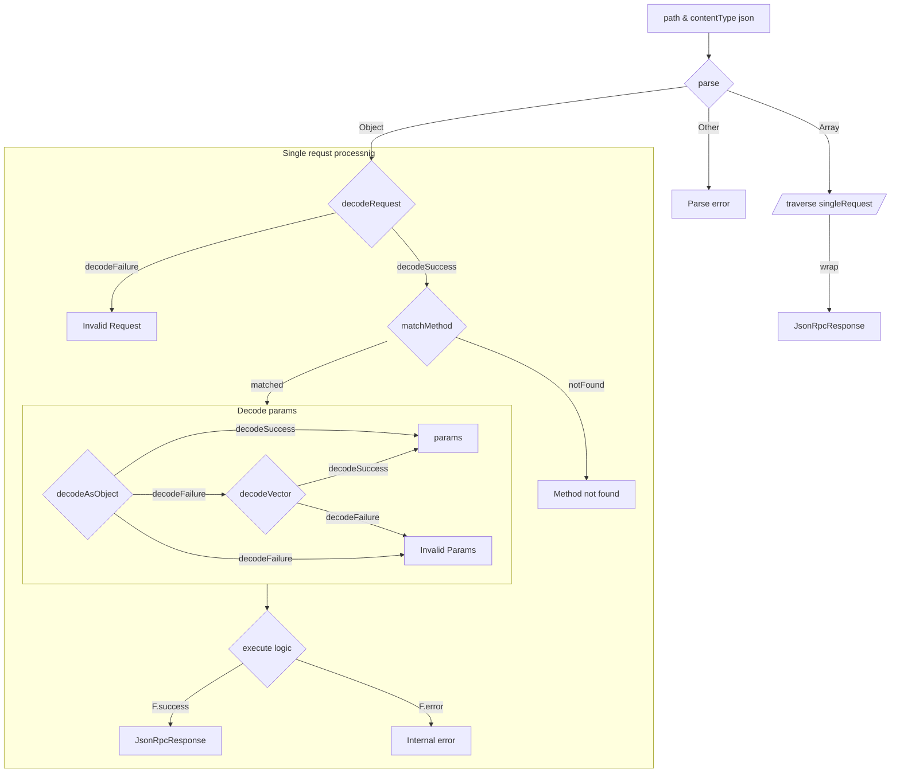

```mermaid
flowchart TD
    A[path & contentType json] --> B{parse}
    B -->|Other| C[Parse error]  
    B -->|Object| E{decodeRequest}
    B -->|Array| G[/traverse singleRequest/]
    G -->|wrap| O[JsonRpcResponse]
    subgraph single [Single requst processnig]
        E -->|decodeFailure| F[Invalid Request]
        E -->|decodeSuccess| H{matchMethod}
        H -->|matched| decodeParams
        H -->|notFound| L[Method not found]
        decodeParams --> K{execute logic} 
        K -->|F.success| M[JsonRpcResponse]
        K -->|F.error| N[Internal error]
    end
    
    subgraph decodeParams [Decode params]
        a{decodeAsObject}
        a -->|decodeSuccess| b[params]
        a -->|decodeFailure| c{decodeVector}
        c -->|decodeSuccess| b[params]
        a & c -->|decodeFailure| J[Invalid Params]      
    end
```